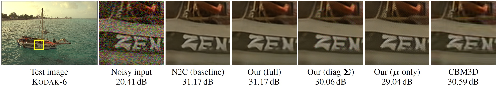

# High-Quality Self-Supervised Deep Image Denoising - Official TensorFlow implementation of the NeurIPS 2019 paper

**Samuli Laine** (NVIDIA), **Tero Karras** (NVIDIA), **Jaakko Lehtinen** (NVIDIA and Aalto University), **Timo Aila** (NVIDIA)

**Abstract**:

_We describe a novel method for training high-quality image denoising models based on unorganized collections of corrupted images. The training does not need access to clean reference images, or explicit pairs of corrupted images, and can thus be applied in situations where such data is unacceptably expensive or impossible to acquire. We build on a recent technique that removes the need for reference data by employing networks with a "blind spot" in the receptive field, and significantly improve two key aspects: image quality and training efficiency. Our result quality is on par with state-of-the-art neural network denoisers in the case of i.i.d. additive Gaussian noise, and not far behind with Poisson and impulse noise. We also successfully handle cases where parameters of the noise model are variable and/or unknown in both training and evaluation data._



## Resources

- [Paper](https://arxiv.org/abs/1901.10277) (arXiv)
- [Pre-trained networks](https://drive.google.com/open?id=1tatE9WFNSqzLm_aso3Wy05j90_wkMmo4)

All material is made available under [Creative Commons BY-NC 4.0](https://creativecommons.org/licenses/by-nc/4.0/) license by NVIDIA Corporation. You can **use, redistribute, and adapt** the material for **non-commercial purposes**, as long as you give appropriate credit by **citing our paper** and **indicating any changes** that you've made.

## Python requirements

This code was tested on:

- Python 3.7
- TensorFlow 1.14
- [Anaconda 2019/07](https://www.anaconda.com/distribution/)

## Preparing training dataset

Our networks have been trained with ImageNet validation set pruned to contain only images between 256x256 and 512x512 pixels in size, yielding 44328 images in total.
To generate the training data hdf5 file, run:

```
# This runs through roughly 50K images and outputs a file called `imagenet_val.h5`.
python dataset_tool_h5.py --input-dir "<path_to_imagenet>/ILSVRC2012_img_val" --out=imagenet_val.h5
```

A successful run of dataset_tool_h5.py should print the following upon completion:

```
<... snip ...>
49997 ./ImageNet/ILSVRC2012_img_val/ILSVRC2012_val_00002873.JPEG
49998 ./ImageNet/ILSVRC2012_img_val/ILSVRC2012_val_00031550.JPEG
49999 ./ImageNet/ILSVRC2012_img_val/ILSVRC2012_val_00009765.JPEG
44328/44328: ./ImageNet/ILSVRC2012_img_val/ILSVRC2012_val_00039330.JPEG
Dataset statistics:
  Total pixels 8375905404
  Formats:
    RGB: 43471 images
    L: 857 images
  width,height buckets:
    >= 256x256: 44328 images
```

## Preparing validation datasets

Validation data is placed under a common directory.  This location can be set using `--dataset-dir <path>` command line argument.  The below examples assume this location is at `$HOME/datasets`.

**Kodak**.  To download the [Kodak Lossless True Color Image Suite](http://r0k.us/graphics/kodak/), run:

```
python download_kodak.py --output-dir=$HOME/datasets/kodak
```

**BSD300**.  From [Berkeley Segmentation Dataset and Benchmark](https://www2.eecs.berkeley.edu/Research/Projects/CS/vision/bsds) download `BSDS300-images.tgz` and extract:

```
cd $HOME/datasets
tar zxf ~/Downloads/BSDS300-images.tgz
```

**Set14**.  From [LapSRN project page](http://vllab.ucmerced.edu/wlai24/LapSRN) download `SR_testing_datasets.zip` and extract:

```
cd $HOME/datasets
unzip ~/Downloads/SR_testing_datasets.zip
```

## Running

Run `python selfsupervised_denoising.py --help` for a complete listing of command line parameters and support list of training configurations.

```
usage: selfsupervised_denoising.py [-h] [--dataset-dir DATASET_DIR]
                                   [--train-h5 TRAIN_H5]
                                   [--validation-set VALIDATION_SET]
                                   [--eval EVAL] [--train TRAIN]

Train or evaluate.

optional arguments:
  -h, --help            show this help message and exit
  --dataset-dir DATASET_DIR
                        Path to validation set data
  --train-h5 TRAIN_H5   Specify training set .h5 filename
  --validation-set VALIDATION_SET
                        Evaluation dataset
  --eval EVAL           Evaluate validation set with the given network pickle
  --train TRAIN         Train for the given config

examples:
  # Train a network with gauss25-blindspot-sigma_global configuration
  python selfsupervised_denoising.py --train=gauss25-blindspot-sigma_global --dataset-dir=$HOME/datasets --validation-set=kodak --train-h5=imagenet_val_raw.h5

  # Evaluate a network using the BSD300 dataset:
  python selfsupervised_denoising.py --eval=$HOME/pretrained/network-00012-gauss25-n2n.pickle --dataset-dir=$HOME/datasets --validation-set=kodak

  List of all configs:

  gauss25-n2c
  gauss25-n2n
  gauss25-blindspot-sigma_known
  ...
```

**Training**:

To train a network, run:

```
python selfsupervised_denoising.py --dataset-dir=$HOME/datasets --validation-set=kodak --train=gauss25-blindspot-sigma_known --train-h5=imagenet_val.h5
```

The specified validation set is evaluated periodically during training.  This can be used to roughly estimate convergence, but
for reliable results the evaluation must be done using the evaluation mode below.

Note that the default settings of running minibatch size of 4 with one GPU requires a lot of memory.  If you run out of memory,
either decrease the minibatch size or run the code on multiple GPUs.  The pre-trained networks were trained on 4 GPUs.

**Evaluating**:

To evaluate a trained network against one of the validation sets, run:

```
python selfsupervised_denoising.py --dataset-dir=$HOME/datasets --validation-set=kodak --eval=$HOME/datasets/pretrained/network-00013-gauss25-blindspot-sigma_known.pickle
```

In evaluation mode, the random seeds are fixed so that the generated noise is repeatable.  This guarantees that each network
is evaluated against the exact same images.  In addition, the validation sets are replicated several times to obtain ~300
total validation images.  This is important especially for variable noise types, to ensure that each image is evaluated using
various amounts of noise.  Note that the noise and network types are inferred from the filename of the trained network.

The evaluation results should match the paper.  For example, the network used in the command-line example should give the following PSNRs:

| Network                       | Kodak    | BSD300   | Set14    |
| ----------------------------- | -------- | -------- | -------- |
| gauss25-blindspot-sigma_known | 32.45 dB | 31.03 dB | 31.25 dB |

## Acknowledgements

We thank Arno Solin and Samuel Kaski for helpful comments, and Janne Hellsten and Tero Kuosmanen for the compute infrastructure.
